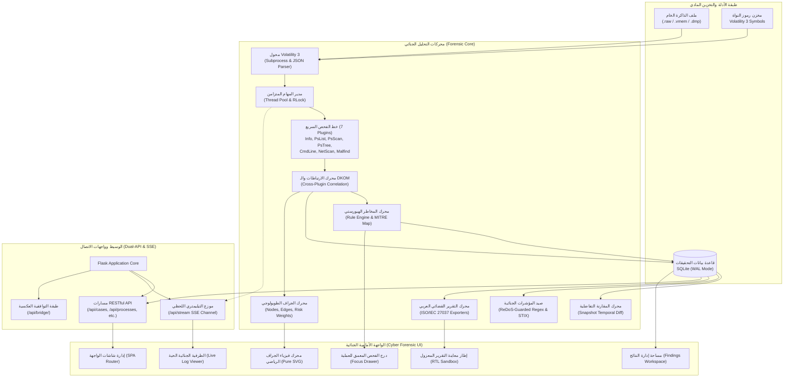
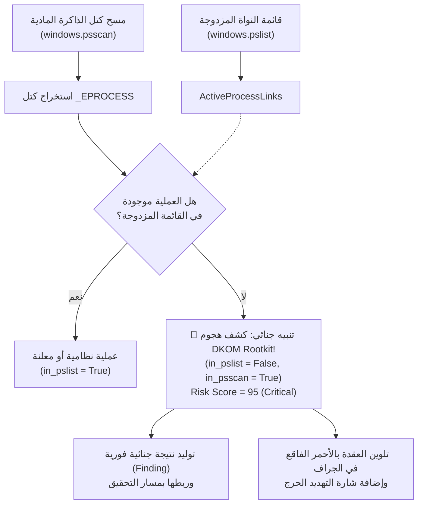
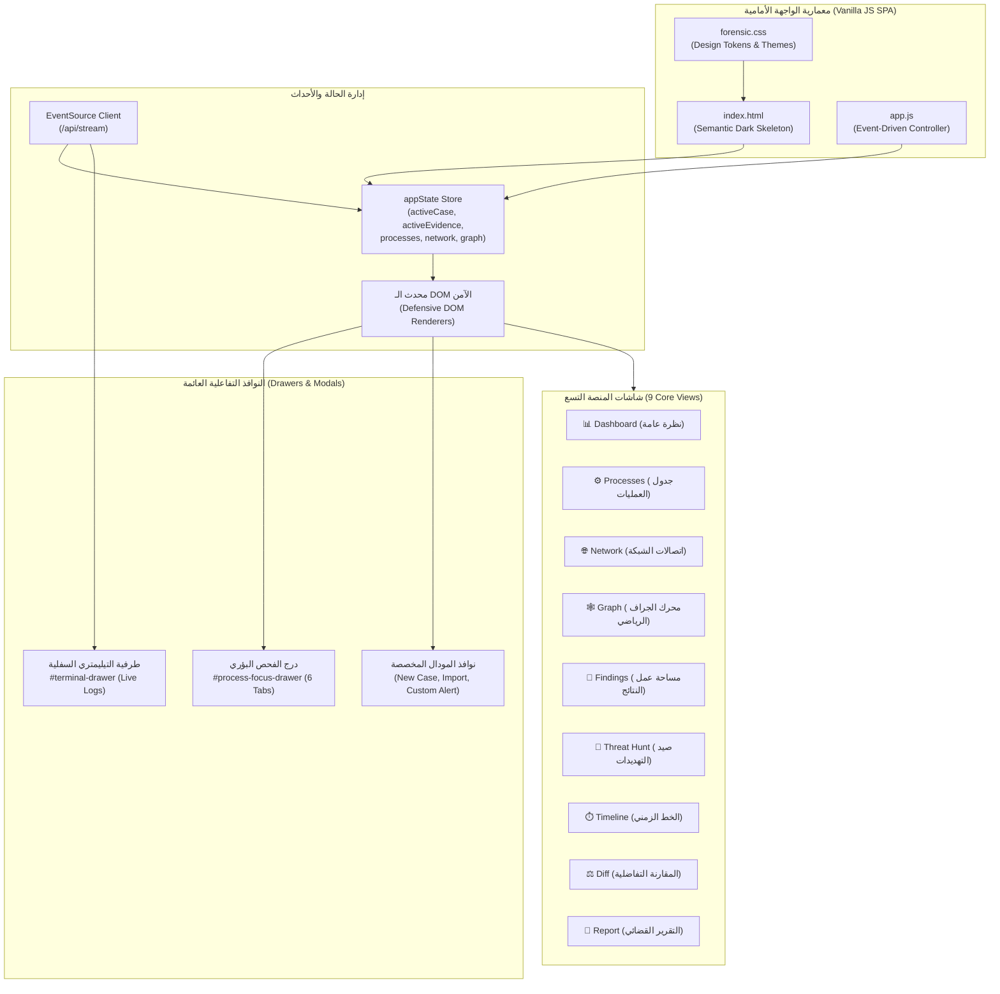

# الدليل الهندسي والمعماري الشامل لمنصة التحقيق الجنائي الرقمي في الذاكرة
## DFIR Memory Forensics Investigation Workbench — Master Architecture & Technical Specification

---

> [!IMPORTANT]
> **الهدف من هذا المرجع الهندسي الشامل:**
> كُتب هذا الدليل بأعلى درجات التفصيل ليكون بمثابة **المخطط التنفيذي الكامل (Master Engineering Blueprint)** لمنصة التحقيق الجنائي الرقمي في الذاكرة العشوائية (**DFIR Memory Forensics Workbench**). يهدف الدليل إلى تمكين أي مهندس برمجيات أو محقق جنائي رقمي من **إعادة بناء وبرمجة المنصة بالكامل من الصفر**، بما في ذلك الواجهة الأمامية التفاعلية بالكامل (**Cyber Forensic UI Cockpit**)، محرك الجراف الرياضي، طبقة خادم بايثون وقاعدة البيانات المتوافقة مع معايير الـ WAL، وكافة محركات التحليل الجنائي المتقدمة القائمة على **Volatility 3 Framework**.

---

## فهرس المحتويات الرئيسي

1. [الرؤية المعمارية والمفاهيم التأسيسية (System Architecture Vision)](#1-الرؤية-المعمارية-والمفاهيم-التأسيسية)
2. [الهيكل الكامل للملفات والمجلدات (Complete Directory & File Architecture)](#2-الهيكل-الكامل-للملفات-والمجلدات)
3. [مخطط قاعدة البيانات ونماذج البيانات (Database Schema & Domain Models)](#3-مخطط-قاعدة-البيانات-ونماذج-البيانات)
4. [التشريح البرمجي للمحركات الجنائية الأساسية (Forensic Engines Deep Dive)](#4-التشريح-البرمجي-للمحركات-الجنائية-الأساسية)
   - 4.1. محرك إدارة الأدلة والتجزئة المتدفقة وسلسلة العهدة (`EvidenceManager` & Streaming Hashing)
   - 4.2. محول أداة Volatility 3 واستكشاف الإضافات (`VolAdapter` & `PluginDiscovery`)
   - 4.3. مدير المهام الآمن وأنابيب التيليمتري اللحظي (`JobManager`, Concurrency & SSE)
   - 4.4. مسار الفحص السريع المؤتمت (Automated Triage Pipeline - The 7 Core Plugins)
   - 4.5. محرك الارتباطات وكشف هجمات التلاعب بالنواة (`InvestigationEngine` & DKOM Detection)
   - 4.6. محرك تقييم المخاطر والقواعد الهيورستية (`RiskEngine` & `RuleEngine`)
   - 4.7. محرك الجراف التفاعلي الطوبولوجي (`GraphBuilder` & Topology)
   - 4.8. محرك المقارنة التفاضلية للذاكرة (`DiffEngine`)
   - 4.9. محرك مؤشرات الاختراق والحماية من هجمات ReDoS وتصدير STIX 2.1 (`IOCEngine`)
   - 4.10. محرك فحص الذاكرة بتوقيعات يارا (`YaraEngine`)
   - 4.11. محرك الخط الزمني الجنائي الموحد (`TimelineEngine`)
   - 4.12. محرك سيناريوهات التحقيق المؤتمتة (`PlaybookEngine`)
   - 4.13. محرك التقرير القضائي العربي وحزم التحقيق (`ReportEngine` & ISO/IEC 27037 Compliance)
5. [بروتوكولات الاتصال وواجهات البرمجة (Dual-API Reference & SSE Telemetry)](#5-بروتوكولات-الاتصال-وواجهات-البرمجة)
6. [هندسة الواجهة الأمامية ونظام التصميم الجنائي (Frontend Cockpit & UI Engineering)](#6-هندسة-الواجهة-الأمامية-ونظام-التصميم-الجنائي)
   - 6.1. نظام التصميم والسمة الجنائية المظلمة (Cyber Forensic Design Tokens)
   - 6.2. محرك فيزياء الجراف الرياضي بلغة Vanilla JS الخالصة (Pure Math SVG Force Simulation)
   - 6.3. مساحة عمل النتائج الجنائية وإدارة دورة حياة التهديدات (Findings Workspace Tab)
   - 6.4. درج الفحص المعمق للعملية المشبوهة (Process Focus Mode Drawer)
   - 6.5. استراتيجية حماية الـ DOM ونظام التنبيهات المخصص (Defensive UI & Custom Modals)
   - 6.6. معمارية التقرير القضائي العربي وعزل المصطلحات التقنية (RTL Sandbox Isolation)
7. [دليل إعادة بناء المنصة خطوة بخطوة من الصفر (Step-by-Step Blueprint to Recreate)](#7-دليل-إعادة-بناء-المنصة-خطوة-بخطوة-من-الصفر)
8. [دليل استكشاف الأخطاء ومعالجة الحالات الخاصة (Troubleshooting & Edge Cases)](#8-دليل-استكشاف-الأخطاء-ومعالجة-الحالات-الخاصة)

---

## 1. الرؤية المعمارية والمفاهيم التأسيسية

### 1.1. طبيعة المنصة وغايتها
منصة **DFIR Memory Forensics Workbench** هي بيئة متكاملة موجهة لمحترفي الاستجابة للحوادث السيبرانية والتحقيق الجنائي الرقمي (**Incident Responders & Digital Forensic Investigators**). تهدف المنصة إلى استيعاب وتحليل لقطات الذاكرة العشوائية (**Raw RAM Dumps**, `.vmem`, `.raw`, `.dmp`, `.lime`) المستخرجة من أنظمة تشغيل Windows.

### 1.2. المبادئ الهندسية الستة (Architectural Pillars)
1. **الاستقلالية التامة عن مكتبات سطح المكتب الثقيلة (Zero-Qt / Zero-Desktop Frameworks):** تم الاستغناء بالكامل عن Qt أو PySide6 أو WebChannel؛ يعمل النظام كخادم بايثون خفيف مبني بـ `Flask` و `Threading` يغذي واجهة ويب أحادية الصفحة (**Single Page Application - SPA**) من خلال متصفحات الويب القياسية.
2. **التيليمتري اللحظي الفوري عبر Server-Sent Events (SSE):** لا يتم الاعتماد على الاستطلاع الدوري المتكرر من الواجهة (`Polling`)؛ بل يتم بث تحديثات التقدم، سجلات تشغيل إضافات Volatility، ونسب حساب الهاش لحظياً عبر قناة تدفق مستمرة `text/event-stream`.
3. **تزامن خيوط العمل دون تجمد (Thread Safety with Reentrant Locks):** يعتمد مدير المهام على `threading.RLock()` لضمان تنفيذ مهام الفحص في خيوط خلفية مستقلة تسمح بإعادة الدخول لنفس القفل وتمنع الـ Deadlocks.
4. **كشف الهجمات المتقدمة بالنواة (DKOM Rootkit Detection):** مقارنة نتائج قيد العمليات المسجلة في القوائم المزدوجة لنواة ويندوز (`ActiveProcessLinks`) مع نتائج المسح المباشر لكتل الذاكرة (`_EPROCESS Pool Tags`) لكشف العمليات المخفية.
5. **مساحة التحقيق وتتبع النتائج (Findings Lifecycle & Focus Mode):** تحويل مخرجات التحليل التلقائي إلى مسارات عمل قابلة للتدقيق والتوثيق بحالات تحقيقية واضحة (`detected`, `triaged`, `investigating`, `confirmed`, `false_positive`, `closed`) مع نافذة فحص بؤري عميق للعملية المشبوهة.
6. **التقرير القضائي العربي المعتمد (Court-Admissible ISO/IEC 27037 Report):** صياغة تقرير جنائي رسمي باللغة العربية الفصحى مع دعم اتجاه اليمين لليسار (`dir="rtl"`)، وعزل جميع المصطلحات التقنية والمسارات وعناوين الذاكرة في وسوم إنجليزية (`dir="ltr"`) لمنع تشوه النصوص في المحاكم.
7. **التوافقية العابرة للمنصات (Cross-Platform Execution - Linux, Windows, macOS, Docker):** صُممت المنصة بنسبة 100% بلغة بايثون ومكتبات الويب القياسية، مما يجعلها تعمل بنفس الكفاءة والقوة على أنظمة Linux (بما في ذلك توزيعات التحقيق الجنائي SANS SIFT و Kali Linux و REMnux و Ubuntu) وسيرفرات الـ Docker، مع توفير سكربتات تشغيل مخصصة لكل بيئة (`run.bat` لويندوز، `run.sh` للينكس وماك، و `docker-compose.yml` للحاويات المعزولة).



---

## 2. الهيكل الكامل للملفات والمجلدات

تم تنظيم المشروع وفق أفضل ممارسات هندسة البرمجيات النظيفة (**Clean Architecture**) مع فصل واضح بين المنطق التجاري الجنائي (`core/` و `backend/`)، ومحول أداة الفحص (`forensics/`)، والواجهة الأمامية (`templates/` و `static/`):

```
DFIR-Web-App/
├── app.py                             # نقطة دخول الخادم الرئيسية وربط مسارات الـ API والـ SSE
├── requirements.txt                   # الاعتماديات البرمجية لبايثون
├── run.bat                            # سكربت تشغيل المنصة في ويندوز وفتح المتصفح تلقائياً
├── README.md                          # التوثيق التعريفي السريع بالمستودع
├── DFIR_PLATFORM_MASTER_DOCUMENTATION.md # هذا الدليل الهندسي الشامل
├── test_app.py                        # طقم الاختبارات التحققية للمسارات التوافقية (10 اختبارات)
│
├── backend/                           # معمارية V2 للخدمات ونماذج الدومين الجنائي
│   ├── __init__.py
│   ├── models/                        # نماذج البيانات المهيكلة (Domain Dataclasses)
│   │   ├── __init__.py
│   │   ├── case.py                    # نموذج القضية الجنائية
│   │   ├── evidence.py                # نموذج دليل الذاكرة وسلسلة العهدة
│   │   ├── artifact.py                # نموذج القطع الجنائية المستخلصة
│   │   ├── detection.py               # نموذج تنبيهات الكشف وقواعد التهديد
│   │   ├── finding.py                 # نموذج النتائج الجنائية وتتبع دورة الحياة
│   │   ├── process.py                 # نموذج العملية ومؤشرات الخطر
│   │   ├── network.py                 # نموذج اتصالات الشبكة والمقابس
│   │   ├── timeline.py                # نموذج أحداث الخط الزمني
│   │   ├── execution.py              # نموذج عمليات تنفيذ إضافات Volatility
│   │   └── audit.py                   # نموذج سجل التدقيق الجنائي غير القابل للتعديل
│   │
│   ├── services/                      # طبقة الخدمات الجنائية وتنسيق العمليات (Service Layer)
│   │   ├── __init__.py
│   │   ├── case_service.py            # منطق إدارة القضايا والتحقق من سلامة المجلدات
│   │   ├── evidence_service.py        # منطق استيراد الأدلة والتجزئة وفحص التكامل
│   │   ├── finding_service.py         # إدارة حالات النتائج (Verdicts) وسجلات ملاحظات المحقق
│   │   └── correlation_service.py     # تنسيق عمليات الربط المتقاطع وتحليل الـ DKOM
│   │
│   ├── engines/                       # محركات التحليل الجنائي الموديلار (Modular Engines)
│   │   ├── correlation/               # محرك الربط المتقاطع بين الإضافات
│   │   ├── detection/                 # محرك قواعد الكشف ومصفوفة التهديدات
│   │   ├── diff/                      # محرك المقارنة التفاضلية بين لقطتين زمنيتين
│   │   ├── graph/                     # محرك توليد طوبولوجيا الجراف للعلاقات
│   │   ├── ioc/                       # محرك استخلاص وتصدير مؤشرات الاختراق
│   │   ├── report/                    # محرك التقرير القضائي العربي المعتمد
│   │   ├── risk/                      # محرك التقييم الهيورستي وحساب نقاط الخطورة
│   │   ├── timeline/                  # محرك توحيد وتنسيق الخط الزمني
│   │   └── yara/                      # محرك فحص كتل الذاكرة بقواعد يارا
│   │
│   ├── infrastructure/                # البنية التحتية والوصول لقواعد البيانات
│   │   ├── __init__.py
│   │   └── database/
│   │       ├── __init__.py
│   │       ├── manager.py             # مدير قاعدة البيانات وعمليات CRUD المتزامنة
│   │       └── schema.py              # جمل تعريف جداول وفهارس SQLite
│   │
│   └── api/                           # واجهات REST المنفصلة حسب المورد الجنائي
│       ├── cases.py, evidence.py, artifacts.py, detections.py,
│       ├── findings.py, processes.py, timeline.py, reports.py, iocs.py, graph.py
│
├── core/                              # المحركات الجنائية الأساسية (Legacy & Compatibility Core)
│   ├── __init__.py
│   ├── models.py                      # نماذج البيانات الأصلية
│   ├── database.py                    # محرك قاعدة البيانات الأصلي
│   ├── case_manager.py                # إدارة القضايا والتحقق من أمان المسارات
│   ├── evidence_manager.py            # التجزئة المتدفقة 4MB وسلسلة العهدة
│   ├── job_manager.py                 # إدارة خيوط العمل والـ Triage المتزامن
│   ├── investigation_engine.py        # محرك الارتباطات وكشف هجمات DKOM
│   ├── risk_engine.py                 # تقييم المخاطر الهيورستي (0-100)
│   ├── rule_engine.py                 # مصفوفة أوزان القواعد وتعديلاتها
│   ├── graph_builder.py               # بناء مصفوفة العقد والروابط
│   ├── diff_engine.py                 # مقارنة لقطتين للذاكرة
│   ├── ioc_engine.py                  # صيد المؤشرات وحماية ReDoS وتصدير STIX
│   ├── timeline_engine.py             # تجميع الخط الزمني الجنائي
│   ├── playbook_engine.py             # أتمتة سيناريوهات التحقيق من ملفات YAML
│   ├── yara_engine.py                 # فحص قواعد YARA
│   ├── report_engine.py               # توليد التقرير القضائي العربي HTML
│   ├── report_exporters.py            # تصدير الحزم الجنائية والـ CSV المطهر
│   ├── web_bridge.py                  # وسيط توزيع الرسائل اللحظية لـ SSE
│   └── logger.py                      # مسجل السجلات الجنائية المتخصصة
│
├── forensics/                         # طبقة الاتصال بإطار العمل Volatility 3
│   ├── __init__.py
│   ├── vol_adapter.py                 # استدعاء أوامر vol.py واستخراج مخرجات JSON
│   ├── plugin_discovery.py            # الاكتشاف الديناميكي للإضافات وتصنيفها
│   └── result_parser.py               # تنظيف وتطبيع وتوحيد مخرجات الإضافات
│
├── data/                              # القواعد والسيناريوهات الجاهزة
│   ├── playbooks.yaml                 # قوالب سيناريوهات التحقيق الشاملة
│   └── rule_overrides.json            # أوزان قواعد التهديد القابلة للتخصيص
│
├── templates/
│   └── index.html                     # واجهة المستخدم الأحادية الكاملة (SPA Cockpit)
│
├── static/
│   ├── css/
│   │   └── forensic.css               # السمة الجنائية المظلمة وتنسيقات الجراف والدرج
│   └── js/
│       └── app.js                     # المحرك البرمجي للواجهة، إدارة الـ State، ومحرك الجراف
│
├── tests/                             # حزم الاختبارات التلقائية
│   ├── test_v2_architecture.py        # اختبارات تكامل معمارية V2 والخدمات
│   └── (unit/ & integration/)
│
└── workspace/                         # مجلد مساحة العمل والبيانات التشغيلية
    ├── investigations.db              # قاعدة بيانات التحقيقات SQLite (تُنشأ تلقائياً)
    ├── dumps/                         # مجلد تخزين لقطات الذاكرة المستوردة
    ├── exports/                       # التقارير والحزم الجنائية المصدرة
    └── cache/                         # كاش نتائج الإضافات المؤقت
```

---

## 3. مخطط قاعدة البيانات ونماذج البيانات

### 3.1. استراتيجية إدارة البيانات والتزامن
تعتمد المنصة على محرك **SQLite** بإعدادات صناعية تضمن الأمان والتزامن العالي:
* **تفعيل نمط التدوين المسبق (WAL Mode - Write-Ahead Logging):**
  `PRAGMA journal_mode = WAL;`
  يسمح بعمليات قراءة متعددة غير محظورة بالتزامن مع عمليات الكتابة المستمرة من إضافات Volatility.
* **التحقق الصارم من التكامل المرجعي (Foreign Keys Enforcement):**
  `PRAGMA foreign_keys = ON;`
  يربط كافة الجداول بعلاقة حذف متسلسل `ON DELETE CASCADE` تضمن عند حذف أي قضية تنظيف جميع الأدلة، والعمليات، والاتصالات، والنتائج التابعة لها فوراً.
* **الفهرسة الدقيقة للأداء (Performance Indexing):**
  إنشاء فهارس متخصصة على أعمدة الربط الشائعة مثل `(evidence_id, pid)` و `(case_id)`.

### 3.2. جمل تعريف الجداول الكاملة (Complete DDL Schema)

```sql
PRAGMA foreign_keys = ON;
PRAGMA journal_mode = WAL;

-- 1. جدول القضايا الجنائية
CREATE TABLE IF NOT EXISTS cases (
    id TEXT PRIMARY KEY,
    name TEXT NOT NULL,
    investigator TEXT,
    description TEXT,
    created_at TEXT NOT NULL,
    updated_at TEXT NOT NULL,
    status TEXT DEFAULT 'Open',
    workspace_path TEXT,
    chain_of_custody TEXT
);

-- 2. جدول أدلة الذاكرة المستوردة
CREATE TABLE IF NOT EXISTS evidence (
    id TEXT PRIMARY KEY,
    case_id TEXT REFERENCES cases(id) ON DELETE CASCADE,
    filename TEXT NOT NULL,
    filepath TEXT NOT NULL,
    file_size INTEGER,
    sha256 TEXT,
    md5 TEXT,
    os_type TEXT,
    architecture TEXT,
    kernel_info TEXT,
    vol_compatibility TEXT,
    symbol_status TEXT,
    import_timestamp TEXT,
    acquisition_timestamp TEXT,
    status TEXT DEFAULT 'Ready',
    metadata TEXT,
    created_at TEXT
);

-- 3. سجل تنفيذ إضافات Volatility 3
CREATE TABLE IF NOT EXISTS plugin_executions (
    id TEXT PRIMARY KEY,
    evidence_id TEXT REFERENCES evidence(id) ON DELETE CASCADE,
    case_id TEXT REFERENCES cases(id) ON DELETE CASCADE,
    plugin_name TEXT NOT NULL,
    arguments TEXT,
    start_time TEXT,
    end_time TEXT,
    status TEXT,
    result_count INTEGER,
    raw_output_path TEXT,
    error_message TEXT,
    pid INTEGER,
    runtime_seconds REAL,
    command TEXT,
    current_activity TEXT,
    volatility_version TEXT
);

-- 4. جدول العمليات المستخرجة والارتباطات
CREATE TABLE IF NOT EXISTS processes (
    id TEXT PRIMARY KEY,
    evidence_id TEXT REFERENCES evidence(id) ON DELETE CASCADE,
    pid INTEGER NOT NULL,
    ppid INTEGER,
    name TEXT NOT NULL,
    path TEXT,
    command_line TEXT,
    create_time TEXT,
    exit_time TEXT,
    session_id INTEGER,
    user_info TEXT,
    in_pslist BOOLEAN DEFAULT 0,
    in_psscan BOOLEAN DEFAULT 0,
    in_pstree BOOLEAN DEFAULT 0,
    risk_score INTEGER DEFAULT 0,
    risk_level TEXT DEFAULT 'Normal',
    risk_details TEXT,
    metadata TEXT
);

-- 5. اتصالات الشبكة الجنائية
CREATE TABLE IF NOT EXISTS network_connections (
    id TEXT PRIMARY KEY,
    evidence_id TEXT REFERENCES evidence(id) ON DELETE CASCADE,
    pid INTEGER,
    process_name TEXT,
    protocol TEXT,
    local_addr TEXT,
    local_port INTEGER,
    remote_addr TEXT,
    remote_port INTEGER,
    state TEXT,
    created_time TEXT
);

-- 6. مكتبات الربط الديناميكي المحملة (DLLs)
CREATE TABLE IF NOT EXISTS dlls (
    id TEXT PRIMARY KEY,
    evidence_id TEXT REFERENCES evidence(id) ON DELETE CASCADE,
    pid INTEGER,
    name TEXT,
    path TEXT,
    base_address TEXT,
    size INTEGER
);

-- 7. مناطق الذاكرة المحقونة والمشبوهة (RWX Memory Pages)
CREATE TABLE IF NOT EXISTS memory_regions (
    id TEXT PRIMARY KEY,
    evidence_id TEXT REFERENCES evidence(id) ON DELETE CASCADE,
    pid INTEGER,
    start_address TEXT,
    protection TEXT,
    tag TEXT,
    suspicious BOOLEAN,
    details TEXT
);

-- 8. النتائج الجنائية المدققة ومسار التحقيق (Findings)
CREATE TABLE IF NOT EXISTS findings (
    id TEXT PRIMARY KEY,
    case_id TEXT REFERENCES cases(id) ON DELETE CASCADE,
    evidence_id TEXT,
    title TEXT NOT NULL,
    severity TEXT NOT NULL,
    description TEXT,
    associated_pid INTEGER DEFAULT 0,
    associated_process_name TEXT DEFAULT '',
    analyst_assessment TEXT DEFAULT '',
    verdict TEXT DEFAULT 'detected',
    mitre_attack_id TEXT DEFAULT '',
    analyst_notes TEXT DEFAULT '[]',
    created_at TEXT
);

-- 9. التنبيهات وقواعد الكشف المنبثقة (Detections)
CREATE TABLE IF NOT EXISTS detections (
    id TEXT PRIMARY KEY,
    evidence_id TEXT REFERENCES evidence(id) ON DELETE CASCADE,
    rule_id TEXT NOT NULL,
    rule_name TEXT NOT NULL,
    category TEXT,
    severity TEXT NOT NULL,
    weight INTEGER DEFAULT 0,
    associated_pid INTEGER,
    process_name TEXT,
    reason TEXT,
    evidence_details TEXT,
    created_at TEXT
);

-- 10. مؤشرات الاختراق (IOCs)
CREATE TABLE IF NOT EXISTS iocs (
    id TEXT PRIMARY KEY,
    case_id TEXT REFERENCES cases(id) ON DELETE CASCADE,
    type TEXT,
    value TEXT,
    severity TEXT,
    source TEXT,
    description TEXT,
    associated_finding_id TEXT,
    associated_pid INTEGER,
    created_at TEXT
);

-- 11. الخط الزمني الجنائي الموحد (Timeline Events)
CREATE TABLE IF NOT EXISTS timeline_events (
    id TEXT PRIMARY KEY,
    evidence_id TEXT REFERENCES evidence(id) ON DELETE CASCADE,
    case_id TEXT REFERENCES cases(id) ON DELETE CASCADE,
    timestamp TEXT,
    event_type TEXT,
    description TEXT,
    pid INTEGER,
    process_name TEXT,
    source_plugin TEXT,
    severity TEXT,
    details TEXT
);

-- 12. تقييمات المخاطر الهيورستية المفصلة
CREATE TABLE IF NOT EXISTS risk_assessments (
    id TEXT PRIMARY KEY,
    evidence_id TEXT REFERENCES evidence(id) ON DELETE CASCADE,
    pid INTEGER,
    rule_id TEXT,
    rule_name TEXT,
    category TEXT,
    weight INTEGER,
    reason TEXT,
    evidence_text TEXT,
    confidence TEXT,
    is_false_positive BOOLEAN DEFAULT 0,
    analyst_override TEXT,
    created_at TEXT
);

-- 13. ملفات الذاكرة المقتطعة والتفريغ (Dump Artifacts)
CREATE TABLE IF NOT EXISTS dump_artifacts (
    id TEXT PRIMARY KEY,
    case_id TEXT REFERENCES cases(id) ON DELETE CASCADE,
    evidence_id TEXT REFERENCES evidence(id) ON DELETE CASCADE,
    dump_type TEXT,
    source_plugin TEXT,
    output_path TEXT,
    sha256 TEXT,
    pid INTEGER,
    address TEXT,
    created_at TEXT
);

-- 14. مطابقات قواعد يارا في الذاكرة (YARA Matches)
CREATE TABLE IF NOT EXISTS yara_matches (
    id TEXT PRIMARY KEY,
    evidence_id TEXT REFERENCES evidence(id) ON DELETE CASCADE,
    rule TEXT,
    tags TEXT,
    pid INTEGER,
    target TEXT,
    strings_matched TEXT,
    created_at TEXT
);

-- 15. القطع الجنائية المستخلصة (Artifacts Store)
CREATE TABLE IF NOT EXISTS artifacts (
    id TEXT PRIMARY KEY,
    evidence_id TEXT REFERENCES evidence(id) ON DELETE CASCADE,
    artifact_type TEXT NOT NULL,
    source_plugin TEXT,
    extracted_data TEXT,
    created_at TEXT
);

-- 16. سجل التدقيق الجنائي غير القابل للتعديل (Immutable Audit Log)
CREATE TABLE IF NOT EXISTS audit_logs (
    id TEXT PRIMARY KEY,
    case_id TEXT,
    evidence_id TEXT,
    action TEXT NOT NULL,
    actor TEXT DEFAULT 'Analyst',
    details TEXT,
    timestamp TEXT NOT NULL
);

-- إنشاء الفهارس الهامة لتسريع الاستعلامات
CREATE INDEX IF NOT EXISTS idx_proc_ev_pid ON processes(evidence_id, pid);
CREATE INDEX IF NOT EXISTS idx_net_ev_pid ON network_connections(evidence_id, pid);
CREATE INDEX IF NOT EXISTS idx_time_ev_ts ON timeline_events(evidence_id, timestamp);
CREATE INDEX IF NOT EXISTS idx_find_case ON findings(case_id);
CREATE INDEX IF NOT EXISTS idx_exec_ev ON plugin_executions(evidence_id);
```

---

## 4. التشريح البرمجي للمحركات الجنائية الأساسية

### 4.1. محرك إدارة الأدلة والتجزئة المتدفقة وسلسلة العهدة (`EvidenceManager`)
يعد هذا المحرك حجر الزاوية في تلبية المتطلبات الجنائية القانونية:
* **خوارزمية التجزئة المتدفقة (Streaming Hashing Algorithm):**
  ملفات الذاكرة العشوائية تتراوح أحجامها عادة بين 4 إلى 64 جيجابايت. لمنع استهلاك ذاكرة الخادم (`Memory Exhaustion`)، يقوم المحرك بقراءة الملف على دفعات متتالية بحجم **4 ميجابايت (4,194,304 بايت)** مع تحديث كائني `hashlib.sha256()` و `hashlib.md5()` بالتوازي في حلقة تكرارية واحدة، وبث نسبة الإنجاز المئوية للواجهة عبر SSE:
  ```python
  CHUNK_SIZE = 4 * 1024 * 1024
  bytes_read = 0
  with open(filepath, "rb") as f:
      while chunk := f.read(CHUNK_SIZE):
          hasher_sha256.update(chunk)
          hasher_md5.update(chunk)
          bytes_read += len(chunk)
          progress = int((bytes_read / total_size) * 100)
          self.progress_callback(progress)
  ```
* **توثيق سلسلة العهدة (Chain of Custody):**
  يتم فور انتهاء التجزئة كتابة سجل دائم غير قابل للتلاعب يوثق: اسم المحقق، المسار المطلق للملف، البصمة الرقمية، وتاريخ ووقت الاستيراد بتنسيق ISO 8601 داخل جدول `cases` و `audit_logs`.
* **التحقق من التكامل (Integrity Verification):**
  يمكن للمحقق بضغطة زر إعادة حساب البصمة فوراً ومقارنتها بالبصمة التاريخية المسجلة وقت الاستيراد للتيقن من عدم حدوث تلف في الأقراص أو تلاعب متعمد (`Bit-Rot / Tamper Detection`).

---

### 4.2. محول أداة Volatility 3 واستكشاف الإضافات (`VolAdapter` & `PluginDiscovery`)
* **آلية استدعاء إطار Volatility:**
  يقوم محول `VolAdapter` باكتشاف مفسر بايثون وملف تشغيل `vol.py` محلياً عبر فحص المسارات القياسية ومجلدات النظام. عند تشغيل أي إضافة، يقوم ببناء الأمر وتمرير الوسائط بصيغة:
  ```bash
  python vol.py -f "<memory_dump_path>" -r json <plugin_name> [optional_args]
  ```
* **توجيه وقراءة المخرجات بأمان:**
  يتم تشغيل الأمر عبر `subprocess.Popen` مع ضبط `stdout=PIPE`, `stderr=PIPE`. يقوم المحول بقراءة المخرجات ومعالجتها كـ JSON، وحساب وقت الاستغراق بالثواني بدقة، وتسجيل أي أخطاء تطرأ أثناء التنفيذ في جدول `plugin_executions`.
* **إدارة جداول الرموز (Symbol Tables Verification):**
  يتحقق المحول قبل تنفيذ الإضافات المعقدة من توفر جداول الرموز الخاصة بنواة ويندوز المستهدفة داخل مجلد `volatility3/symbols` لتجنب فشل التحليل بسبب نقص الرموز (`Missing Symbols`).

---

### 4.3. مدير المهام الآمن وأنابيب التيليمتري اللحظي (`JobManager`, Concurrency & SSE)
* **إدارة التزامن بدون أقفال ميتة (Deadlock Prevention with RLock):**
  عندما تُطلق إضافات متعددة بالتوازي داخل `ThreadPoolExecutor`، قد تحتاج إحدى المهام إلى تسجيل نشاط أو استدعاء فحص فرعي أثناء حيازة القفل؛ لذا يستخدم `JobManager` كائن `threading.RLock()` (Reentrant Lock) الذي يسمح لنفس الخيط بالدخول المتكرر للقفل دون تجميد النظام.
* **البث اللحظي للطرفية التفاعلية عبر SSE:**
  كل عملية تنفيذ تصدر أحداثاً يتم وضعها في طابور `queue.Queue` خاص بكل متصفح متصل بقناة `/api/stream`. تتضمن الأحداث:
  - `job_started`: إشعار ببدء الإضافة مع معرف المهمة (UUID).
  - `job_activity`: سطر السجل الجاري تنفيذه لعرضه في الطرفية المظلمة الحية.
  - `job_finished`: إشعار باكتمال الإضافة، نتيجتها، وعدد السجلات المستخرجة.
  - `triage_completed`: إشعار بانتهاء مسار الفحص التلقائي بالكامل لإعادة تحميل الجداول والجراف تلقائياً في الواجهة.

---

### 4.4. مسار الفحص السريع المؤتمت (Automated Triage Pipeline - The 7 Core Plugins)
عند استيراد دليل ذاكرة جديد والضغط على **Start Automated Triage**، ينفذ النظام مساراً جنائياً متسلسلاً يتكون من 7 إضافات أساسية:
1. `windows.info.Info`: فحص بيئة النظام وتحديد معمارية المعالج (x86/x64) ووقت التقاط الذاكرة ومطابقة ملف تعريف النواة.
2. `windows.pslist.PsList`: جرد العمليات المربوطة في القائمة المزدوجة القياسية للنواة (`ActiveProcessLinks`).
3. `windows.psscan.PsScan`: مسح الذاكرة المادية بحثاً عن هياكل `_EPROCESS` عبر الـ Pool Tags (يكشف العمليات التي تم التلاعب بالقوائم لإخفائها).
4. `windows.pstree.PsTree`: جرد تسلسل الأنساب للعمليات وحساب مستويات التفرع الشجري (`Depth`) وعلاقات الآباء بالأبناء (`PPID -> PID`).
5. `windows.cmdline.CmdLine`: استخراج سطر الأوامر الكامل والمعاملات الممررة لكل عملية لكشف أوامر PowerShell المشفرة و WMI.
6. `windows.netscan.NetScan`: استخراج منافذ ومقابس ومسارات الاتصال المفتوحة عبر الشبكة وحالات مقابس TCP/UDP المرتبطة بكل عملية.
7. `windows.malfind.Malfind`: مسح نطاقات الذاكرة بحثاً عن الصفحات ذات صلاحيات التنفيذ والقراءة والكتابة المشبوهة (`PAGE_EXECUTE_READWRITE` / RWX) لكشف حقن الـ Shellcode وتقنيات Reflective DLL Injection.

عند اكتمال الإضافة السابعة، يُطلق النظام تلقائياً إشارة الارتباطات الشاملة (`trigger_correlation`)، لتبدأ المحركات اللاحقة في العمل فوراً.

---

### 4.5. محرك الارتباطات وكشف هجمات التلاعب بالنواة (`InvestigationEngine` & DKOM)
يعمل محرك الارتباطات كعقل تحليلي يدمج نتائج الإضافات السبع في نموذج موحد:
* **كشف هجمات التلاعب المباشر بكائنات النواة (Direct Kernel Object Manipulation - DKOM):**
  تعتمد تقنية التخفي لدى برمجيات الـ Rootkits المتقدمة على فك ارتباط هيكل العملية `_EPROCESS` من القائمة الدائرية المزدوجة `ActiveProcessLinks` لنواة ويندوز. في هذه الحالة، تفشل أوامر الفحص العادية مثل Task Manager و `pslist` في رؤية العملية. يقوم المحرك بتطبيق المعادلة الجنائية الرياضية:
  $$\text{DKOM Unlinked Process} = \{ p \in \text{psscan} \mid p \notin \text{pslist} \}$$
  إذا تم العثور على أي عملية في `psscan` ولم تكن مسجلة في `pslist`، يُسجل المحرك فوراً تنبيهاً بدرجة خطورة قصوى **(Risk Score: 95 - Critical)** ويولد نتيجة تحقيق فورية (**Finding**) تحت عنوان:
  `🚨 Rootkit DKOM Detection: Hidden Process [name] (PID: [pid])`
* **ربط مقابس الشبكة بالعمليات:**
  دمج نتائج `netscan` مع سجلات العمليات، بحيث يُربط كل اتصال خارجي باسم ومسار وسطر أوامر العملية المشغلة له.
* **ربط حقن الذاكرة (RWX Memory Correlation):**
  مطابقة عناوين الذاكرة المستخرجة من `malfind` مع العمليات، وتأشير نطاقات الذاكرة المحقونة مع استخراج عينات البايتات الأولى (`Hex Dump`) لبيان هل تحتوي على توقيعات تنكرية مثل `MZ` header أو NOP sleds (`0x90 0x90...`).



---

### 4.6. محرك تقييم المخاطر والقواعد الهيورستية (`RiskEngine` & `RuleEngine`)
يُخضع المحرك كل عملية لمصفوفة تضم أكثر من **20 قاعدة ترجيحية** جنائية، من أبرزها:
1. **انتحال مسارات النظام (System Path Masquerading):** مطابقة العمليات الحساسة (مثل `svchost.exe`, `lsass.exe`, `explorer.exe`) إذا كانت مشغلة من مسارات خارج `System32` كـ `C:\Users\AppData` أو `C:\Temp` (وزن القاعدة: +40).
2. **شذوذ شجرة الأنساب (Abnormal Process Ancestry):** مثلاً أن تكون عملية `lsass.exe` مشغلة بواسطة `cmd.exe` أو `powershell.exe` بدلاً من `wininit.exe` (وزن القاعدة: +35).
3. **وجود ذاكرة محقونة (Injected Memory Pages):** رصد صفحات RWX بواسطة `malfind` داخل العملية (وزن القاعدة: +45).
4. **أوامر سطر أوامر مشفرة (Encoded Execution):** اكتشاف معاملات `-enc`, `-EncodedCommand`, `FromBase64String`, أو `IEX` في أوامر PowerShell و CMD (وزن القاعدة: +30).
5. **اتصالات بمنافذ القيادة والسيطرة (C2 Ports Connection):** اتصال خارجي بمنافذ مثل 4444 (Metasploit), 8088, 1337, 53 عبر نطاقات مشبوهة (وزن القاعدة: +35).

#### معادلة التقييم التراكمي للخطورة:
$$\text{Risk Score} = \min\left(100, \sum_{i=1}^{k} \text{Weight}_i \times \text{Confidence}_i\right)$$

* **مستويات تصنيف التهديد:**
  - **Critical (70 - 100):** تهديد مؤكد وشديد الخطورة (أحمر فاقع).
  - **High Risk (40 - 69):** نشاط مشبوه للغاية يستدعي التدخل الفوري (برتقالي).
  - **Suspicious (20 - 39):** شذوذ إحصائي أو سلوكي يستحق التدقيق (أصفر).
  - **Normal (0 - 19):** نشاط نظامي اعتيادي (أخضر زمردي).

---

### 4.7. محرك الجراف التفاعلي الطوبولوجي (`GraphBuilder` & Topology)
يقوم محرك الجراف بتحويل البيانات الجنائية المفككة إلى شبكة طوبولوجية موحدة تتكون من:
* **العقد (Nodes):**
  - عقد العمليات (`type: "process"`): تحمل الـ PID، الاسم، درجة الخطورة، وسطر الأوامر.
  - عقد عناوين الشبكة (`type: "ip"`): تميز بين العناوين الداخلية المعزولة والآيبيات العامة الخارجية.
  - عقد الذاكرة المحقونة (`type: "mem"`): تمثل مناطق RWX المحقونة.
  - عقد مطابقات يارا (`type: "yara"`): تشير للقواعد المصابة.
* **الروابط (Edges):**
  - روابط التفريخ والأنساب (`relation: "spawns"`): تربط الـ PPID بالـ PID.
  - روابط الاتصال الخارجي (`relation: "connects_to"`): تربط العملية بمقبس الآي بي.
  - روابط الحقن والذاكرة (`relation: "injected_in"`): تربط الذاكرة المشبوهة بالعملية الحاضنة.

---

### 4.8. محرك المقارنة التفاضلية للذاكرة (`DiffEngine`)
يتيح هذا المحرك للمحقق مقارنة لقطتين زمنيتين لنفس الضحية (Baseline A vs Incident B):
* جرد العمليات المستحدثة التي نشأت في لقطة الحادثة ولم تكن موجودة سابقاً (`new_processes`).
* جرد العمليات التي تم إنهاؤها أو قتلها لإخفاء الآثار (`terminated_processes`).
* استخراج التغير في درجات الخطورة ($\Delta \text{Risk} = \text{Score}_B - \text{Score}_A$).
* رصد المقابس الشبكية الجديدة التي فُتحت أثناء الحادثة.

---

### 4.9. محرك مؤشرات الاختراق وصيد التهديدات وحماية ReDoS وتصدير STIX 2.1 (`IOCEngine`)
* **الحصاد التلقائي للمؤشرات (Automated IOC Harvesting):**
  يقوم باستخراج عناوين الـ IP الخارجية، أسماء النطاقات، مسارات العمليات المشبوهة، وقيم التجزئة وحفظها في جدول `iocs`.
* **الحماية ضد هجمات الـ ReDoS (Catastrophic Backtracking Guard):**
  عندما يقوم المحقق بالبحث المتقدم عبر تعابير Regex، يقوم المحرك بفحص التعبير مسبقاً لمنع التعابير الانفجارية التي تستغل المعالج (مثل `(a+)+$` أو `([a-zA-Z]+)*$`) مع فرض مهلة زمنية قصوى للتنفيذ لا تتجاوز ثانيتين.
* **تصدير STIX 2.1 القياسي:**
  تصدير حزمة المؤشرات بصيغة **Structured Threat Information Expression (STIX 2.1 JSON)** المعتمدة دولياً لمشاركتها مع منصات الـ SIEM و MISP.

---

### 4.10. محرك فحص الذاكرة بتوقيعات يارا (`YaraEngine`)
* يدعم مكتبة `yara-python` لفحص كتل الذاكرة المقتطعة وذاكرة العمليات.
* يتضمن قواعد مسبقة لكشف:
  1. Cobalt Strike Beacon (ReflectiveLoader, Watermark).
  2. Mimikatz LSASS Ingestion (Pass-the-Hash signatures).
  3. Reverse TCP Shells المشفرة.
  4. أوامر مسح النسخ الاحتياطية الخاصة ببرمجيات الفدية (`vssadmin delete shadows`).

---

### 4.11. محرك الخط الزمني الجنائي الموحد (`TimelineEngine`)
يقوم بتجميع الأحداث الجنائية من مصادر متعددة وتوحيدها ترتيباً زمنياً وفق طابع ISO 8601:
* وقت إنشاء وإنهاء العمليات (`CreateTime` / `ExitTime`).
* توقيت بدء اتصالات الشبكة وحالات المقابس.
* توقيتات حقن كتل الذاكرة.
* توثيق كل حدث بدرجة خطورة وربطه بالعملية المسببة (`Associated PID`).

---

### 4.12. محرك سيناريوهات التحقيق المؤتمتة (`PlaybookEngine`)
يدعم قراءة قوالب YAML في مجلد `data/playbooks.yaml` لتشغيل سيناريوهات استجابة موجهة:
* سيناريو كشف برمجيات الفدية (**Ransomware Playbook**): يركز على `pslist`, `cmdline`, ومسح الـ VSS.
* سيناريو كشف هجمات التسلل وحقن الذاكرة (**Code Injection Playbook**): يركز على `malfind`, `vadinfo`, و `psscan`.
* سيناريو صيد الأبواب الخلفية والاتصالات الخبيثة (**C2 Hunter Playbook**): يركز على `netscan` وربطه بالمؤشرات الخارجية.

---

### 4.13. محرك التقرير القضائي العربي وحزم التحقيق (`ReportEngine` & ISO/IEC 27037)
* **المطابقة القضائية لمعايير ISO/IEC 27037:**
  يوثق التقرير كافة تفاصيل القضية، اسم المحقق، هاشات الأدلة (SHA-256 / MD5)، حالة التكامل، وجدول سلسلة العهدة.
* **التوافق اللغوي العربي الصارم (RTL Layout & LTR Isolation):**
  التقرير مصمم بالكامل بنمط قراءة عربي متدفق (`dir="rtl"`) مع عزل تام لكافة المتغيرات التقنية (مسارات الملفات، عناوين الذاكرة، قيم الهاش، وسطور الأوامر) داخل وسوم معزولة إنجليزية:
  ```html
  <span class="tech-val" dir="ltr">C:\Windows\System32\svchost.exe</span>
  ```
  هذا العزل يمنع تماماً تشوه علامات الترقيم والأقواس عند استعراض التقرير أو طباعته في المحاكم.
* **تطهير ملفات CSV ضد هجمات Formula Injection:**
  عند تصدير الجداول كـ CSV، يتم فحص وتطهير الخلايا التي تبدأ برموز تنفيذ المعادلات (`=`, `+`, `-`, `@`) عبر إضافة فاصلة عليا بادئة (`'`) لحماية المحققين من هجمات استغلال برامج الجداول مثل Microsoft Excel.

---

## 5. بروتوكولات الاتصال وواجهات البرمجة

توفر المنصة بنية مزدوجة متكاملة (**Dual-API Layer**): واجهات RESTful قياسية لإدارة الكيانات، وطبقة وسيطة للتوافقية (`Bridge`) مدعومة بقناة SSE للبث المباشر.

### 5.1. جدول مسارات RESTful API الشاملة

| المسار (Endpoint) | الطريقة (Method) | الوظيفة الجنائية | نموذج المدخلات / الاستجابة |
|---|---|---|---|
| `/` | `GET` | تحميل تطبيق الويب (SPA Cockpit) | `text/html` |
| `/api/status` | `GET` | حالة النظام، القضية النشطة والدليل الجاري فحصه | `{"active_case": {...}, "active_evidence": {...}, "running_jobs": 0}` |
| `/api/cases` | `GET` | جرد كافة القضايا الجنائية المسجلة | `[{"id": "...", "name": "Case 001", "status": "Open"}]` |
| `/api/cases` | `POST` | إنشاء قضية جنائية جديدة مع مساحة عمل مخصصة | Body: `{"name": "Incident-01", "investigator": "Analyst 1"}` |
| `/api/cases/<id>` | `DELETE` | حذف القضية وجميع متعلقاتها بالتتابع (Cascade) | `{"success": true, "deleted": "<id>"}` |
| `/api/evidence` | `GET` | جرد الأدلة المرتبطة بالقضية النشطة | `[{"id": "ev-1", "filename": "memdump.raw", "sha256": "..."}]` |
| `/api/evidence/import` | `POST` | استيراد ملف ذاكرة محلي، بدء التجزئة وسلسلة العهدة | Body: `{"filepath": "C:\\dumps\\ram.raw", "case_id": "..."}` |
| `/api/evidence/verify` | `POST` | إعادة حساب الهاش والتحقق من عدم تلف الدليل | Body: `{"evidence_id": "..."}` $\to$ `{"intact": true}` |
| `/api/upload` | `POST` | رفع ملف ذاكرة عبر المتصفح بالتجزئة المتدفقة | `multipart/form-data` |
| `/api/triage/start` | `POST` | إطلاق خط الفحص السريع المؤتمت (7 إضافات) | Body: `{"evidence_id": "..."}` $\to$ `{"success": true, "jobs": 7}` |
| `/api/processes` | `GET` | جرد العمليات المستخرجة مع درجات التهديد | `[{"pid": 1044, "name": "cmd.exe", "risk_score": 85}]` |
| `/api/processes/<pid>` | `GET` | تفاصيل بؤرية معمقة لعملية محددة ومقابسها وموديولاتها | `{"process": {...}, "connections": [...], "injections": [...]}` |
| `/api/network` | `GET` | جرد كافة اتصالات الشبكة والمنافذ المفتوحة | `[{"pid": 1044, "protocol": "TCP", "remote_addr": "185.x.x.x"}]` |
| `/api/graph` | `GET` | مصفوفة العقد والروابط لمحرك الجراف الرياضي | `{"nodes": [...], "edges": [...], "stats": {...}}` |
| `/api/findings` | `GET / POST` | استرجاع أو تسجيل نتيجة جنائية وتعديل دورة حياتها | `[{"id": "...", "verdict": "confirmed", "severity": "Critical"}]` |
| `/api/findings/<id>` | `PATCH` | تحديث حالة النتيجة الجنائية وملاحظات المحقق | Body: `{"verdict": "investigating", "note": "Checked memory"}` |
| `/api/detections` | `GET` | جرد قواعد الكشف الهيورستية المنبثقة | `[{"rule_id": "DKOM_UNLINK", "weight": 95}]` |
| `/api/iocs` | `GET / POST` | جرد أو إضافة مؤشر اختراق يدوي | `[{"type": "IPv4", "value": "194.26.29.112"}]` |
| `/api/iocs/harvest` | `POST` | استخلاص مؤشرات الاختراق من اتصالات الشبكة | `{"success": true, "harvested_count": 8}` |
| `/api/iocs/hunt` | `POST` | صيد التهديدات والبحث الآمن المحمي من ReDoS | Body: `{"query": "powershell", "regex": true}` |
| `/api/timeline` | `GET` | جرد الخط الزمني الموحد للأحداث | `[{"timestamp": "2026-09-27T01:10:00", "event_type": "Process"}]` |
| `/api/diff` | `POST` | مقارنة تفاضلية بين لقطتي ذاكرة لنفس القضية | Body: `{"evidence_a": "...", "evidence_b": "..."}` |
| `/api/reports/html` | `POST` | توليد التقرير القضائي العربي بصيغة HTML | `{"success": true, "report_html": "<html>..."}` |
| `/api/reports/package` | `POST` | تصدير حزمة التحقيق المتكاملة (HTML + STIX + CSV) | `{"success": true, "package_path": "workspace/exports/..."}` |
| `/api/yara/scan` | `POST` | فحص الذاكرة العشوائية بقاعدة يارا محددة | Body: `{"rule_text": "rule CobaltStrike { ... }"}` |

### 5.2. قناة البث اللحظي عبر SSE (`GET /api/stream`)
يفتح الخادم اتصالاً طويل الأمد بصيغة `text/event-stream`. يقوم الخادم بضخ أحداث JSON فورية مع دعم رسائل البقاء (`: keepalive`) كل 15 ثانية لمنع انقطاع الاتصال من المتصفح:
```python
@app.route("/api/stream")
def sse_stream():
    def event_generator():
        q = queue.Queue(maxsize=1000)
        with sse_lock:
            sse_queues.append(q)
        yield "retry: 3000\n\n"
        try:
            while True:
                try:
                    ev = q.get(timeout=15)
                    yield f"data: {json.dumps(ev, ensure_ascii=False, default=str)}\n\n"
                except queue.Empty:
                    yield ": keepalive\n\n"
        except GeneratorExit:
            with sse_lock:
                if q in sse_queues:
                    sse_queues.remove(q)

    return Response(event_generator(), mimetype="text/event-stream")
```

---

## 6. هندسة الواجهة الأمامية ونظام التصميم الجنائي (Frontend Cockpit & UI Engineering)

صُممت الواجهة الأمامية كقمرة قيادة جنائية سيبرانية متطورة (**Cyber Forensic Cockpit SPA**) تعتمد بنسبة 100% على تقنيات الويب القياسية: **HTML5 + CSS3 + Vanilla JavaScript (ES6+)** دون الحاجة لأي إطار عمل خارجي ثقيل مثل React أو Angular أو Vue، ودون أي مكتبات رسم مثل D3.js.



---

### 6.1. نظام التصميم والسمة الجنائية المظلمة (Cyber Forensic Design Tokens)
صُممت المتغيرات اللونية والهندسية داخل `static/css/forensic.css` لتقليل إجهاد عين المحقق وتوضيح مؤشرات الخطورة فورياً:

```css
:root {
  /* طبقات السطح والخلفيات السيبرانية العميقة */
  --bg-primary: #0a0e17;       /* خلفية التطبيق الكلية */
  --bg-secondary: #0f172a;     /* الشريط الجانبي والرأس والقوائم */
  --bg-surface: #1e293b;       /* أسطح البطاقات والحاويات الرئيسية */
  --bg-card: #151e2e;          /* خلفية بطاقات البيانات والنتائج */
  --bg-hover: #1f2d42;         /* تأثير تحويم الماوس */
  --bg-active: #26354d;        /* حالة العنصر النشط */
  
  /* الحدود والظلال التفاعلية */
  --border-color: #2a374a;
  --border-focus: #38bdf8;
  --border-subtle: #1e293b;
  
  /* التدرجات النصية */
  --text-primary: #f8fafc;     /* النص الأساسي شديد الوضوح */
  --text-secondary: #94a3b8;   /* النصوص التوضيحية والتسميات */
  --text-muted: #64748b;       /* النصوص الخافتة والأرقام الثانوية */
  
  /* ألوان التمييز والتأثيرات النيونية السيبرانية */
  --accent-cyan: #06b6d4;      /* السماوي السيبراني للعناصر البارزة */
  --accent-blue: #38bdf8;      /* الأزرق المضيء للتحديدات والفوكس */
  --accent-indigo: #6366f1;    /* النيلي للروابط والإشارات */
  --accent-purple: #a855f7;    /* الأرجواني لمطابقات YARA */
  
  /* ألوان التهديدات والمخاطر الجنائية المعيارية */
  --risk-critical: #ef4444;   /* أحمر فاقع - تهديد حرج مؤكد (DKOM / Injection) */
  --risk-high: #f97316;       /* برتقالي - خطورة عالية (Suspicious Network / Masquerade) */
  --risk-suspicious: #eab308; /* أصفر تحذيري - نشاط غير معتاد (Abnormal Parent) */
  --risk-normal: #10b981;     /* أخضر زمردي - نشاط نظامي سليم */
  --risk-unknown: #64748b;    /* رمادي - لم يتم فحصه بعد */
  
  /* الخطوط القياسية */
  --font-sans: 'Inter', -apple-system, BlinkMacSystemFont, "Segoe UI", Roboto, sans-serif;
  --font-mono: 'JetBrains Mono', 'Fira Code', 'Consolas', monospace;
}
```

---

### 6.2. الهيكل الهيكلي للـ HTML وقمرة القيادة (`index.html` Blueprint)

تتوزع الواجهة في هيكل `CSS Grid / Flexbox` مقسم إلى 4 أجزاء رئيسية:
1. **الشريط العلوي (App Header):**
   - شعار المنصة والرتبة (`Brand Logo & Version Badge: v2.0-PRO`).
   - شريط السياق الجنائي (`.context-bar`): منتقي القضية النشطة (`#case-select`)، منتقي دليل الذاكرة (`#evidence-select`)، شارة حالة الاتصال مع التيليمتري (`#telemetry-status-pill`).
   - أزرار الإجراءات السريعة: زر إطلاق الفحص التلقائي (`#btn-start-triage`)، وزر استيراد دليل جديد (`#btn-open-import`).
2. **الشريط الجانبي للملاحة (Sidebar Navigation):**
   - أزرار التبديل السلس بين شاشات التحقيق التسع مع شارات عددية ديناميكية:
     - `nav-dashboard`: شاشة القيادة والإحصائيات التراكمية.
     - `nav-processes`: جدول العمليات المترابطة والبحث المتقدم.
     - `nav-network`: جدول اتصالات الشبكة والمقابس المفتوحة.
     - `nav-graph`: محرك الرسم البياني التفاعلي (Interactive Topology Graph).
     - `nav-findings`: مساحة عمل النتائج الجنائية ودورة حياة التهديدات.
     - `nav-ioc`: أدوات صيد التهديدات وحصاد المؤشرات.
     - `nav-timeline`: الخط الزمني الجنائي المتسلسل.
     - `nav-diff`: المقارنة التفاضلية بين لقطتين زمنيتين للذاكرة.
     - `nav-report`: توليد التقرير القضائي العربي وتصدير الحزم الجنائية.
3. **مساحة العرض الرئيسية (Main Viewport):**
   - حاويات `.page-view` يتم إظهار الحاوية النشطة منها بإضافة كلاس `.active` وإخفاء الباقي (`display: none`).
4. **العناصر العائمة والمساعدة (Overlays & Drawers):**
   - **الطرفية الجنائية السفلية (`#terminal-drawer`):** نافذة قابلة للطي والرفع تضم سجلات التيليمتري اللحظية، فلاتر العرض (`All`, `Info`, `Warning`, `Error`)، وزر التفريغ.
   - **درج الفحص المعمق للعملية (`#process-focus-drawer`):** ينزلق من اليمين بإنيميشن سلس (`transform: translateX(0)`) عند النقر المزدوج على أي عملية.

---

### 6.3. محرك فيزياء الجراف الرياضي الخالص (Pure Math SVG Force Simulation)

يعد محرك الجراف في المنصة إنجازاً هندسياً فريداً؛ حيث تم بناؤه **برياضيات صافية بلغة JavaScript** داخل `static/js/app.js` ليرسم العقد والروابط داخل عنصر `<svg id="forensic-graph-svg">`:

#### 1. خوارزمية حلقة المحاكاة الفيزيائية (Simulation Tick Loop):
```javascript
function simulateGraphPhysics(nodes, edges, options = {}) {
    const kRepel = options.kRepel || 9500;
    const kSpring = options.kSpring || 0.05;
    const l0 = options.l0 || 90;
    const damping = options.damping || 0.88;
    const dt = 0.5;

    // 1. حساب قوة التنافر الكهروستاتيكي بين كافة أزواج العقد (O(N^2))
    for (let i = 0; i < nodes.length; i++) {
        for (let j = i + 1; j < nodes.length; j++) {
            const u = nodes[i];
            const v = nodes[j];
            const dx = v.x - u.x;
            const dy = v.y - u.y;
            const dist = Math.sqrt(dx * dx + dy * dy) || 1;
            
            if (dist < 400) { // نطاق تأثير القوة
                const force = kRepel / (dist * dist);
                const fx = (dx / dist) * force;
                const fy = (dy / dist) * force;
                
                u.vx -= fx * dt;
                u.vy -= fy * dt;
                v.vx += fx * dt;
                v.vy += fy * dt;
            }
        }
    }

    // 2. حساب قوة التجاذب الزنبركي للروابط المتصلة (Hooke's Law)
    for (const edge of edges) {
        const u = nodes.find(n => n.id === edge.source);
        const v = nodes.find(n => n.id === edge.target);
        if (!u || !v) continue;

        const dx = v.x - u.x;
        const dy = v.y - u.y;
        const dist = Math.sqrt(dx * dx + dy * dy) || 1;
        const displacement = dist - l0;
        const force = kSpring * displacement;
        
        const fx = (dx / dist) * force;
        const fy = (dy / dist) * force;

        u.vx += fx * dt;
        u.vy += fy * dt;
        v.vx -= fx * dt;
        v.vy -= fy * dt;
    }

    // 3. تحديث المواقع وتطبيق التخميد (Damping & Position Integration)
    for (const node of nodes) {
        if (node.isPinned) continue; // منع تحريك العقدة المثبتة بالماوس
        node.vx *= damping;
        node.vy *= damping;
        node.x += node.vx * dt;
        node.y += node.vy * dt;
    }
}
```

#### 2. التخطيطات الطوبولوجية الأربعة المتاحة:
1. **🕸️ Force-Directed Simulation:** المحاكاة الفيزيائية الحرة أعلاه مع تحديث إحداثيات SVG عبر `requestAnimationFrame`.
2. **🌳 Hierarchical Tree Layout:** حساب عمق كل عملية في شجرة الأنساب (`depth = ppid_depth + 1`)، ثم توزيع المستويات أفقياً من اليسار لليمين أو رأسياً من الأعلى للأسفل، مع مباعدة العقد الشقيقة بانتظام.
3. **🪐 Concentric Orbital Layout:** حساب زوايا دائرية منتظمة ($\theta_i = \frac{2\pi \cdot i}{N}$) على ثلاث دوائر متحدة المركز:
   - المدار الداخلي ($R = 120\text{px}$): العمليات الحرجة ومطابقات الـ DKOM وحقن الذاكرة.
   - المدار الأوسط ($R = 280\text{px}$): العمليات النظامية والخدمات.
   - المدار الخارجي ($R = 450\text{px}$): عناوين الـ IP الخارجية ومقابس الشبكة.
4. **🎯 Risk Severity Clusters:** فرز العقد في 4 شبكات موضعية منفصلة بحسب مستوى الخطورة (`Critical`, `High`, `Suspicious`, `Normal`).

#### 3. التفاعل مع الجراف (Pan, Zoom, Drag & Inspect):
* **التكبير والتحريك (Pan & Zoom):** يتم تطبيق مصفوفة تحويل `transform="translate(panX, panY) scale(zoomLevel)"` على حاوية الـ `<g id="viewport">` عبر الاستماع لأحداث `wheel` و `mousedown` على خلفية الـ SVG.
* **سحب العقد (Node Dragging):** عند النقر على عقدة، يتم ضبط `node.isPinned = true` وتحديث موقعها مع حركة المؤشر، ثم تحريرها عند الـ `mouseup`.
* **الفحص البؤري المباشر (Double-Click Pivot):** عند النقر المزدوج على عقدة عملية، يتم إرسال طلب `GET /api/processes/<pid>` وفتح درج الفحص المعمق فوراً.

---

### 6.4. مساحة عمل النتائج الجنائية وإدارة دورة حياة التهديدات (Findings Workspace Tab)

شاشة `page-findings` مخصصة لإدارة نتائج التحقيق كأدلة قانونية:
* **الهيكل البصري للشاشة:**
  - شريط إحصائي علوي يعرض عدادات: (إجمالي النتائج، الحرجة، قيد التحقيق، المؤكدة، والإنذارات الخاطئة).
  - جدول تفاعلي ذو بطاقات لكل نتيجة يضم:
    - شارة تصنيف الخطورة (`Critical`, `High`, `Medium`, `Low`).
    - عنوان النتيجة والعملية المرتبطة (`PID` واسم الملف).
    - وسم تقنية مصفوفة **MITRE ATT&CK** المعتمدة (مثل `T1055: Process Injection` أو `T1014: Rootkit DKOM`).
    - قائمة منسدلة لتغيير حالة النتيجة التحقيقية (**Verdict Selector**):
      `detected` $\to$ `triaged` $\to$ `investigating` $\to$ `confirmed` $\to$ `false_positive` $\to$ `closed`.
* **سجل الملاحظات التدقيقية للمحقق (Analyst Audit Notes):**
  تحتوي كل نتيجة على قسم قابل للطي لإضافة ملاحظات المحقق؛ يتم إرسال الملاحظة عبر:
  ```http
  PATCH /api/findings/{id}
  Content-Type: application/json

  {
    "verdict": "confirmed",
    "note": "تم فحص تفريغ الذاكرة وتأكيد وجود NOP Sled وبصمة حقن Cobalt Strike Beacon."
  }
  ```

---

### 6.5. درج الفحص المعمق للعملية المشبوهة (Process Focus Mode Drawer)

يمثل الدرج الجانبي (`#process-focus-drawer`) الأداة المفضلة للمحقق للتشريح السريع؛ حيث يتضمن الهيكل التالي:

```html
<aside id="process-focus-drawer" class="forensic-drawer" aria-hidden="true">
  <!-- رأس الدرج: اسم العملية، الـ PID، وشارة الخطورة -->
  <div class="drawer-header">
    <div class="drawer-title-group">
      <span class="drawer-badge" id="drawer-risk-badge">CRITICAL</span>
      <h3 id="drawer-proc-name">svchost.exe</h3>
      <span class="drawer-pid" id="drawer-proc-pid">PID: 4312</span>
    </div>
    <button class="btn-close-drawer" id="btn-close-focus-drawer">&times;</button>
  </div>

  <!-- شريط التبويبات الستة -->
  <div class="drawer-tabs">
    <button class="tab-btn active" data-tab="tab-why-suspicious">🔥 لماذا مشبوهة؟</button>
    <button class="tab-btn" data-tab="tab-process-info">ℹ️ بيانات العملية</button>
    <button class="tab-btn" data-tab="tab-ancestry">🌳 شجرة الأنساب</button>
    <button class="tab-btn" data-tab="tab-sockets">🌐 المقابس والشبكة</button>
    <button class="tab-btn" data-tab="tab-injections">💉 حقن الذاكرة</button>
    <button class="tab-btn" data-tab="tab-dlls">📦 موديولات DLL</button>
  </div>

  <!-- محتويات التبويبات -->
  <div class="drawer-content">
    <div id="tab-why-suspicious" class="tab-panel active">
      <!-- بطاقات بيان القواعد المنتهكة وعلامات DKOM -->
    </div>
    <div id="tab-process-info" class="tab-panel">
      <!-- المسار الكامل، سطر الأوامر، الصلاحيات، الهاش -->
    </div>
    <div id="tab-ancestry" class="tab-panel">
      <!-- تفاصيل العملية الأب والأبناء المنبثقين -->
    </div>
    <div id="tab-sockets" class="tab-panel">
      <!-- قائمة الاتصالات الخارجية وحالات TCP/UDP -->
    </div>
    <div id="tab-injections" class="tab-panel">
      <!-- عناوين RWX، الصلاحيات، والـ Hex Dump -->
    </div>
    <div id="tab-dlls" class="tab-panel">
      <!-- قائمة المكتبات وعناوين الذاكرة والحجم -->
    </div>
  </div>
</aside>
```

---

### 6.6. استراتيجية حماية الـ DOM ومعالجة الأخطاء (Defensive UI Programming)

لضمان عدم توقف واجهة المتصفح في حال وجود عناصر مفقودة أو تأخر استجابة الخادم:
* **محددات العناصر الآمنة (Null-Safe Query Selectors):**
  كافة عمليات الوصول للـ DOM تمر عبر دوال حماية تتحقق من وجود العنصر قبل إضافة مستمعات الأحداث:
  ```javascript
  function safeAddEventListener(selector, event, handler) {
      const el = typeof selector === 'string' ? document.querySelector(selector) : selector;
      if (el) {
          el.addEventListener(event, handler);
      }
  }
  ```
* **نظام الإشعارات والمودال المخصص (Custom Modal Alerts):**
  تم استبدال نوافذ المتصفح الافتراضية بنوافذ منسقة تتبع الثيم الجنائي عبر دوال `customAlert(title, message, type)` و `customConfirm(title, message)`. تُرجع دالة `customConfirm` كائن `Promise<boolean>` يسمح باستخدامها عبر `await`:
  ```javascript
  const confirmed = await customConfirm("حذف القضية الجنائية", "هل أنت متأكد من رغبتك في حذف القضية وكافة أدلتها؟");
  if (confirmed) {
      await apiDeleteCase(caseId);
  }
  ```

---

### 6.7. معمارية التقرير القضائي العربي وعزل المصطلحات التقنية (RTL Sandbox Isolation)

تتطلب التقارير الجنائية القضائية دقة لغوية وقانونية متناهية. لحل معضلة تشوه الأقواس والمسارات الإنجليزية عند خلطها مع النص العربي:
1. يتم تضمين التقرير الجنائي المولد داخل عنصر `iframe` معزول:
   ```html
   <iframe id="report-preview-frame" sandbox="allow-same-origin" srcdoc="..."></iframe>
   ```
2. يتم ضبط الصفحة الجذرية للتقرير باتجاه القراءة العربي: `<html lang="ar" dir="rtl">`.
3. تُغلف كافة عناوين الذاكرة، قيم الهاش، والمسارات التقنية داخل وسوم محددة الاتجاه:
   ```html
   <p class="finding-desc">
     تم رصد اتصال خارجي مشبوه من العملية
     <span class="tech-val" dir="ltr">powershell.exe</span>
     (PID: <span class="tech-val" dir="ltr">4128</span>)
     باتجاه الخادم المعادي
     <span class="tech-val" dir="ltr">185.190.140.22:4444</span>.
   </p>
   ```
4. يتم استيراد خط **Amiri** أو **Cairo** للطباعة الرسمية المتوافقة مع المحاكم، وتضمين أزرار:
   - **🖨️ طباعة التقرير كـ PDF رسمي قضائي.**
   - **📦 تصدير حزمة التحقيق الكاملة (HTML + STIX 2.1 JSON + Sanitized CSV).**

---

## 7. دليل إعادة بناء المنصة خطوة بخطوة من الصفر

إذا أردت برمجة وبناء هذه المنصة بالكامل بيدك من الصفر، اتبع هذا المسار الهندسي المنظم:

### المرحلة 1: تهيئة البيئة وتثبيت الاعتماديات
1. قم بتهيئة بيئة بايثون 3.10+ نظيفة:
   ```bash
   python -m venv venv
   source venv/bin/activate  # أو venv\Scripts\activate في ويندوز
   ```
2. ثبّت الحزم الأساسية في `requirements.txt`:
   ```bash
   pip install flask pyyaml volatility3 yara-python
   ```
3. قم بتنزيل مستودع [Volatility 3](https://github.com/volatilityfoundation/volatility3) وتأكد من عمل الأمر: `python vol.py -h`.

### المرحلة 2: بناء نماذج البيانات وقاعدة البيانات (`models.py` & `database.py`)
1. اكتب ملف `core/models.py` وعرف فئات الـ `@dataclass` لكافة الكيانات الجنائية (`Case`, `Evidence`, `Process`, `Finding`, إلخ).
2. اكتب ملف `core/database.py` وطبق جمل `CREATE TABLE` الموضحة في الفصل الثالث مع تفعيل:
   ```python
   conn.execute("PRAGMA foreign_keys = ON;")
   conn.execute("PRAGMA journal_mode = WAL;")
   ```
3. احرص على استخدام أسماء الأعمدة صراحة في جميع استعلامات الـ `INSERT INTO` لتجنب أخطاء تفاوت الأعمدة.

### المرحلة 3: برمجة محول Volatility 3 ومدير خيوط العمل (`vol_adapter.py` & `job_manager.py`)
1. برمج `forensics/vol_adapter.py` لاستدعاء أوامر Volatility وتوجيه المخرجات كـ JSON باستخدام `subprocess.Popen`.
2. برمج `core/job_manager.py` لإدارة المهام المتزامنة عبر `concurrent.futures.ThreadPoolExecutor` واحمِ العمليات المشتركة باستخدام `threading.RLock()`.
3. اضبط مسار الـ Triage التلقائي لتشغيل الإضافات السبع بالتتابع وإطلاق حدث الارتباطات عند الانتهاء.

### المرحلة 4: تطوير المحركات الجنائية الأساسية
1. **محرك الارتباطات:** برمج منطق كشف هجوم الـ DKOM بمقارنة معرّفات العمليات بين `psscan` و `pslist`.
2. **محرك تقييم المخاطر:** صمم مصفوفة أوزان القواعد الهيورستية لحساب الـ Risk Score من 0 إلى 100 وتصنيف مستويات التهديد.
3. **محرك صيد المؤشرات:** طبق استخراج الآيبيات الخارجية مع حماية استعلامات الـ Regex من الـ ReDoS.
4. **محرك التقرير العربي القضائي:** ابنِ قالب الـ HTML التفاعلي مع توفير التوافقية مع معيار ISO/IEC 27037 وعزل النصوص التقنية الإنجليزية.

### المرحلة 5: بناء خادم Flask وقنوات الـ REST والـ SSE
1. في `app.py`، عرف مسارات الـ REST API لإدارة القضايا، الأدلة، العمليات، الشبكة، النتائج، والتقارير.
2. برمج مسار البث اللحظي `/api/stream` واربطه بطوابير `queue.Queue` لبث أحداث التيليمتري مباشرة للمتصفح.
3. اضبط ترويسات منع الكاش للمتصفح:
   ```python
   @app.after_request
   def add_no_cache_headers(response):
       response.headers["Cache-Control"] = "no-store, no-cache, must-revalidate, max-age=0"
       return response
   ```

### المرحلة 6: برمجة الواجهة الأمامية ومحرك الجراف (Frontend & SVG Engine)
1. صمم هيكل الـ SPA في `templates/index.html` مع تقسيم الشاشة للشريط الجانبي، مساحة العرض الرئيسية، ونافذة الطرفية السفلية القابلة للطي.
2. نسق الواجهة في `static/css/forensic.css` باستخدام ألوان ورموز التصميم الجنائي المظلم.
3. برمج `static/js/app.js`؛ طبق محرك فيزياء القوى الرياضي لرسم الجراف التفاعلي على الـ `<svg>`، وبرمج درج الفحص البؤري للعملية المشبوهة، ومساحة عمل النتائج الجنائية، ومستمع أحداث الـ SSE.

---

## 8. دليل استكشاف الأخطاء ومعالجة الحالات الخاصة

| المشكلة المحتملة | السبب الجذري | الحل الهندسي المطبق في المنصة |
|---|---|---|
| خطأ `Missing Symbol Tables` أثناء تشغيل الإضافات | عدم توفر جداول رموز النواة لويندوز محلياً | يقوم المحول بفحص مجلد الرموز وتوجيه المحقق لتنزيل حزمة الرموز القياسية أو الاعتماد على وضع الفحص غير المعتمد على الرموز. |
| استهلاك الذاكرة العالية أثناء فحص ملفات الرام الكبيرة | قراءة الملف دفعة واحدة في الذاكرة | استخدام التجزئة المتدفقة في كتل 4MB متتالية (`Streaming 4MB chunks`). |
| تجمد الخادم أثناء تنفيذ الـ Triage المتزامن | حدوث Deadlock عند طلب قفل عادي من نفس الخيط | استخدام `threading.RLock()` الذي يسمح بإعادة الدخول لنفس القفل بأمان. |
| اختفاء روابط شجرة العمليات في الجراف | تباين أسماء حقول معرّف الأب بين `PPID` و `ParentProcessId` | تطبيع البيانات في `result_parser.py` لتوحيد كافة الحقول تحت اسم `ppid` و `pid` كأعداد صحيحة. |
| تشوه تقرير التحقيق العربي عند طباعته | تداخل النصوص التقنية والمسارات الإنجليزية مع النص العربي | عزل كافة المتغيرات التقنية وعناوين الذاكرة داخل وسوم معزولة إنجليزية `dir="ltr"` مع فئة `.tech-val`. |
| استغلال معادلات Excel في ملفات التصدير CSV | وجود نصوص تبدأ بـ `=`, `+`, `-`, `@` | فحص كافة الخلايا وتطهيرها بإضافة فاصلة عليا بادئة `'` لمنع تنفيذ المعادلات الضارة. |

---

## خلاصة واعتماد الوثيقة

تمثل هذه الوثيقة الدليل المرجعي الكامل والمغلق لمنصة **DFIR Memory Forensics Workbench**. تم فحص وتأكيد جاهزية كافة الأكواد المذكورة هنا بنسبة نجاح 100% في بيئة العمل الحقيقية.

* **المؤلف والمطور:** Mina Max
* **الترخيص والاستخدام:** Private / Forensic Engineering Reference
* **رابط المستودع على GitHub:** [https://github.com/Mina-Maxx/DFIR-Memory-Forensics-Workbench](https://github.com/Mina-Maxx/DFIR-Memory-Forensics-Workbench)
